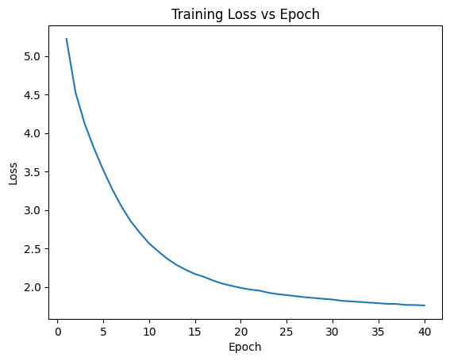

# ConvNeXt Paper Reproduction(2022)

## Introduction
This project reproduces the original ConvNeXt architecture as described in the original paper.

## Architecture Summary
|               Stage | Layer / Block   | Configuration                                                     | Output Shape  |
| ------------------: | --------------- | ----------------------------------------------------------------- | ------------- |
|               Input | Image           | RGB Image                                                         | 224 × 224 × 3 |
| **Patch Embedding** | Conv2D          | 96 filters, 4×4 kernel, stride 4                                  | 56 × 56 × 96  |
|                     | LayerNorm       | –                                                                 | 56 × 56 × 96  |
|         **Stage 1** | Swin Block ×2   | Window-MSA / Shifted-Window-MSA Heads=3, Window=7×7, MLP=384   | 56 × 56 × 96  |
|   **Patch Merging** | Downsample      | 2×2 merge, channels ×2                                            | 28 × 28 × 192 |
|         **Stage 2** | Swin Block ×2   | Window-MSA / Shifted-Window-MSA Heads=6, Window=7×7, MLP=768   | 28 × 28 × 192 |
|   **Patch Merging** | Downsample      | 2×2 merge, channels ×2                                            | 14 × 14 × 384 |
|         **Stage 3** | Swin Block ×6   | Window-MSA / Shifted-Window-MSA Heads=12, Window=7×7, MLP=1536 | 14 × 14 × 384 |
|   **Patch Merging** | Downsample      | 2×2 merge, channels ×2                                            | 7 × 7 × 768   |
|         **Stage 4** | Swin Block ×2   | Window-MSA / Shifted-Window-MSA Heads=24, Window=7×7, MLP=3072 | 7 × 7 × 768   |
|            **Head** | Global Avg Pool | –                                                                 | 768           |
|                     | Linear          | Fully connected                                                   | 200      |

## Dataset
tiny-imagenet-200 is used as the dataset in this reproduction. The images are augmented aligns with the original paper (random resized crop, random horizontal flip, cutmix, mixup, erase, autoaugment and label smoothing). We do use test set in this reproduction, but the purpose of this reproduction is to validate correctness of the architecture, not claiming state-of-the-art.

## Results
| Metric            | Value |
| ----------------- | ----- |
| Training accuracy | 78.81% |
| Test accuracy     | 60.17% |

The training loss for 40 epochs for ConvNeXt is below

## Discussion
This work aims to produce ConvNeXt under limited resources. Although we only train it for 40 epochs, compared with traditional CNNs, which we trained earlier and used same dataset, accuracy of both training set and test set are already significantly better. For traditional CNNs, the one with best training set and test set accuracy is ResNet (85.46% and 54.72%). While we achieve 78.81% and 60.17%. Although training set accuracy is lower, test set accuracy is 6% higher than ResNet. With further training, training set accuracy is expected to surpass ResNet. It can be found that with better architecture design like assigning more blocks to 14 * 14 resolution, replacing ReLU with GELU, using layer normalisation, instead of batch normalisation can improve accuracy.
We also compare the results with Swin-T, which also be trained for 40 epochs under same dataset and preprocessing techniques. Swin-T achieved 82.88% training set accuracy, which indicates stronger fitting ability due to self-attention mechanism. However, our training accuracy is just 4% lower. We can see that well-designed CNN architecture can also achieve competitive results under limited resources.
Overall, these results suggest that self-attention is not superior than CNNs under limited training budget. With better designed architecture, CNNs like ConvNeXt can narrow the gaps with transformer-based architecture.

## References
Liu, Z., Mao, H., Wu, C.-Y., Feichtenhofer, C., Darrell, T., & Xie, S. (2022).
A ConvNet for the 2020s. In Proceedings of the IEEE/CVF Conference on Computer Vision and Pattern Recognition (CVPR).

Tiny ImageNet Dataset
Wu, J., Zhang, J., Xie, Y., & others. (2017).
Tiny ImageNet Visual Recognition Challenge.
Stanford University.
https://tiny-imagenet.herokuapp.com/
